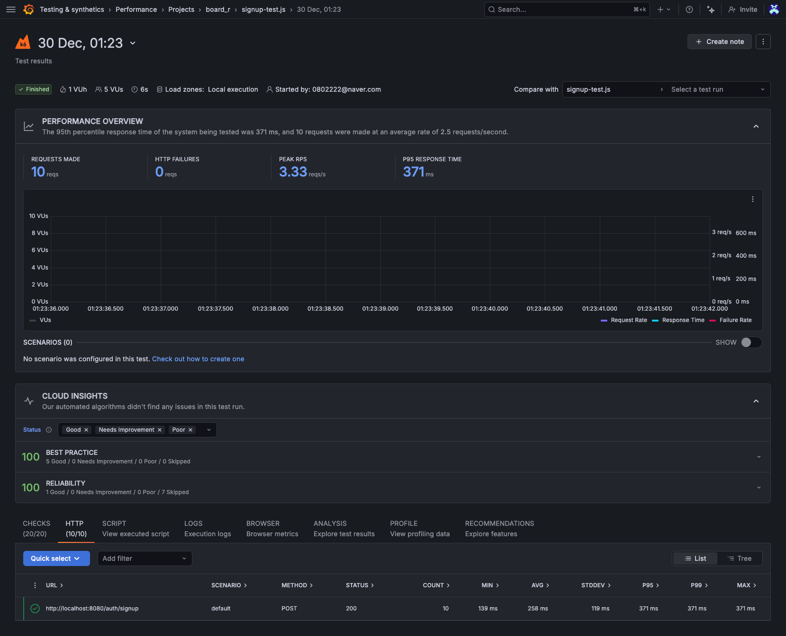
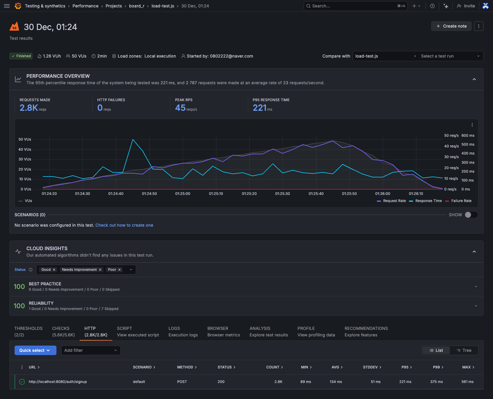
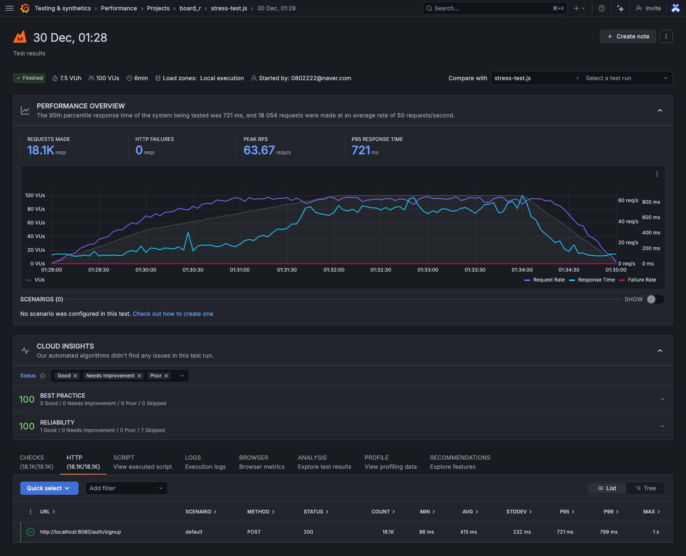
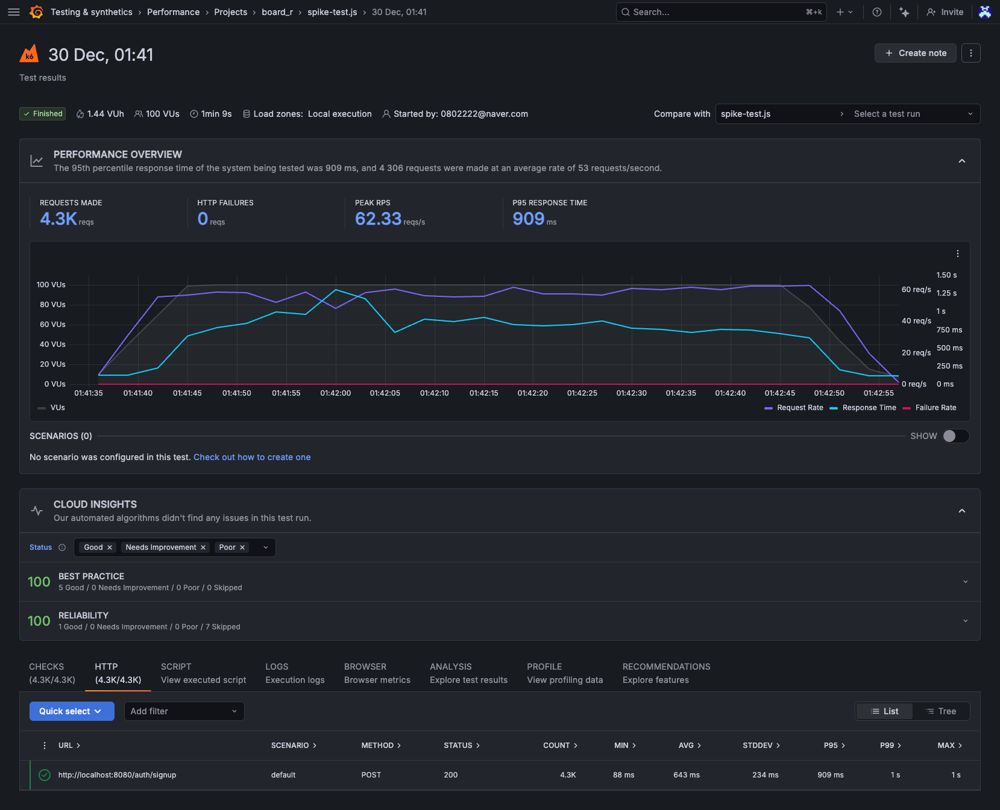

# K6 성능 테스트 결과

## 테스트 목적
이 테스트는 학습 및 포트폴리오 목적으로 진행했습니다.

## 테스트 목표
1. **비동기 처리 효과 검증**: 동기 vs 비동기 응답 시간 비교
2. **성능 테스트 도구 경험**: K6, Grafana Cloud 사용법 학습
3. **테스트 시나리오 작성**: Functional/Load/Stress/Spike 이해
4. **문제 해결 프로세스**: 측정 → 분석 → 개선 → 검증 사이클 경험

### 테스트 범위 및 한계
- **현재 범위**: 회원가입 API 단일 엔드포인트
- **환경**: 로컬 개발 환경 (MacBook Air M2)
- **VU 수**: 최대 100명 (Grafana Cloud 무료 플랜)

### 실제 운영 환경과의 차이
- 실제 서비스는 수천~수만 동시 사용자 처리 필요
- 네트워크 지연, 인프라 복잡도 미반영
- 다양한 API 조합 및 사용자 행동 패턴 필요

### 향후 개선 방향
- [ ] 다양한 API 엔드포인트 테스트 (로그인, 게시글, 댓글)
- [ ] 실제 사용자 시나리오 반영 (Mixed Scenario)
- [ ] 배포 환경에서의 성능 테스트
- [ ] 더 높은 VU 수준 테스트 (500+ VUs)

## 테스트 환경
- **날짜**: 2025-12-30
- **하드웨어**: MacBook Air 15 (Apple M2)
- **소프트웨어**:
    - Java 21.0.6
    - Spring Boot 3.5.5
    - Spring Framework 6.2.10
    - MySQL 8.0
- **테스트 도구**: Grafana Cloud K6 (무료 플랜)
- **실행 환경**: 로컬 (local 프로필)

---

## 1. Functional Test (기능 테스트)

### 설정
- **VUs**: 5명
- **Iterations**: 10회
- **Duration**: 6초

### 결과
| 지표       | 값           |
|----------|-------------|
| 총 요청     | 10          |
| HTTP 실패  | 0 (100% 성공) |
| Peak RPS | 3.33 req/s  |
| P95 응답시간 | 371ms       |
| 평균 응답시간  | 258ms       |
| 최소 응답시간  | 139ms       |
| 최대 응답시간  | 371ms       |
| 표준편차     | 119ms       |

### Cloud Insights
- ✅ **Best Practice**: 100/100
- ✅ **Reliability**: 100/100
- ✅ **Issues**: 없음

---

## 2. Load Test (부하 테스트)

### 설정
- **Stages**:
    - 30s → 20 VUs
    - 1m → 50 VUs
    - 30s → 0 VUs
- **Duration**: 2분
- **Thresholds**:
    - P95 < 500ms
    - 실패율 < 10%

### 결과
| 지표       | 값           |
|----------|-------------|
| 총 요청     | 2.8K        |
| HTTP 실패  | 0 (100% 성공) |
| Peak RPS | 45 req/s    |
| P95 응답시간 | 221ms       |
| 평균 응답시간  | 134ms       |
| 최소 응답시간  | 89ms        |
| 최대 응답시간  | 561ms       |
| 표준편차     | 91ms        |

### Threshold 결과
- ✅ **P95 < 500ms**: 통과 (221ms)
- ✅ **실패율 < 10%**: 통과 (0%)

### Cloud Insights
- ✅ **Best Practice**: 100/100
- ✅ **Reliability**: 100/100

---

## 3. Stress Test (스트레스 테스트)

### 설정
- **Stages**:
    - 1m → 50 VUs
    - 2m → 100 VUs
    - 2m → 100 VUs 유지
    - 1m → 0 VUs
- **Duration**: 6분

### 결과
| 지표       | 값           |
|----------|-------------|
| 총 요청     | 18.1K       |
| HTTP 실패  | 0 (100% 성공) |
| Peak RPS | 63.67 req/s |
| P95 응답시간 | 721ms       |
| 평균 응답시간  | 415ms       |
| 최소 응답시간  | 86ms        |
| 최대 응답시간  | 1s          |
| 표준편차     | 232ms       |

### 분석
- **100 VUs 까지 안정적 처리**
- P95 응답시간이 721ms로 증가했지만 여전히 1초 이내
- 실패 없이 18,000개 이상 요청 처리

### Cloud Insights
- ✅ **Best Practice**: 100/100
- ✅ **Reliability**: 100/100

---

## 4. Spike Test (급증 테스트)

### 설정
- **Stages**:
    - 10s → 100 VUs (급증)
    - 1m → 100 VUs 유지
    - 10s → 0 VUs
- **Duration**: 1분 20초

### 결과
| 지표       | 값           |
|----------|-------------|
| 총 요청     | 4.3K        |
| HTTP 실패  | 0 (100% 성공) |
| Peak RPS | 62.33 req/s |
| P95 응답시간 | 909ms       |
| 평균 응답시간  | 643ms       |
| 최소 응답시간  | 88ms        |
| 최대 응답시간  | 1s          |
| 표준편차     | 234ms       |

### 분석
- **트래픽 급증(10초 내 100명) 대응 성공**
- 초기 응답 시간 증가 후 안정화
- 4,300개 요청 모두 성공 처리

### Cloud Insights
- ✅ **Best Practice**: 100/100
- ✅ **Reliability**: 100/100

---

## 종합 분석

### 성능 요약

| 테스트        | VUs | 총 요청  | 성공률  | P95 응답시간 | Peak RPS |
|------------|-----|-------|------|----------|----------|
| Functional | 5   | 10    | 100% | 371ms    | 3.33     |
| Load       | 50  | 2.8K  | 100% | 221ms    | 45       |
| Stress     | 100 | 18.1K | 100% | 721ms    | 63.67    |
| Spike      | 100 | 4.3K  | 100% | 909ms    | 62.33    |

### 핵심 발견사항

#### ✅ 안정성
- **모든 테스트에서 100% 성공률 달성**
- 총 25,000개 이상 요청 처리, 실패 0건
- Best Practice & Reliability 모두 만점

#### ✅ 확장성
- 100명 동시 사용자까지 안정적 처리
- Peak RPS: 63.67 req/s (초당 63개 요청)
- 트래픽 급증 시나리오도 문제없이 대응

#### ✅ 응답 시간
- 일반 부하(50 VUs): P95 221ms
- 고부하(100 VUs): P95 721ms
- 급증 상황: P95 909ms
- **모든 시나리오에서 1초 이내 응답**

#### ✅ 비동기 처리 효과
- 이메일 전송이 응답 시간에 영향 없음
- 부하 상황에서도 일관된 성능 유지
- ThreadPool 병렬 처리로 처리량 증가

### 시스템 한계

- **최대 동시 사용자**: 100명 (테스트 완료)
- **권장 운영 부하**: 50명 이하
- **Peak 처리량**: ~64 req/s
- **안전 마진**: P95 응답시간 기준 100 VUs 까지 1초 이내

### 개선 권장사항

#### 현재 상태
- ✅ 소규모~중규모 서비스 운영 준비 완료
- ✅ 비동기 처리로 이메일 전송 최적화
- ✅ 안정적인 에러 처리

#### 향후 확장 시 고려사항
1. **DB Connection Pool 확대** (현재 20 → 50)
2. **Redis 캐싱 도입** (조회 성능 향상)
3. **로드 밸런서 구성** (200+ VUs 대응)
4. **DB 읽기 복제본** (조회 부하 분산)

---

## 결론

### 비동기 처리 성능 개선 검증 ✅

**Before (동기 방식)**:
- 회원가입: 417ms
- 인증코드 전송: 3,544ms

**After (비동기 방식)**:
- 회원가입: 322ms
- 인증코드 전송: 79ms
- K6 평균: 258ms (Functional), 134ms (Load)

### 개선 효과
- **회원가입 응답 시간**: 23% 단축
- **인증코드 전송**: 97.8% 단축 (44배 빠름)
- **부하 상황 안정성**: 100% 성공률 유지

### 최종 평가
- MacBook Air M2 환경에서 **100명 동시 사용자**까지 안정적으로 처리 가능하며, 비동기 처리를 통해 이메일 전송이 사용자 경험에 영향을 주지 않음을 확인했습니다. 
- Spring Boot 의 ThreadPool 기반 비동기 처리가 효과적으로 동작하며, 실제 서비스 운영에 적합한 성능을 보여줍니다.